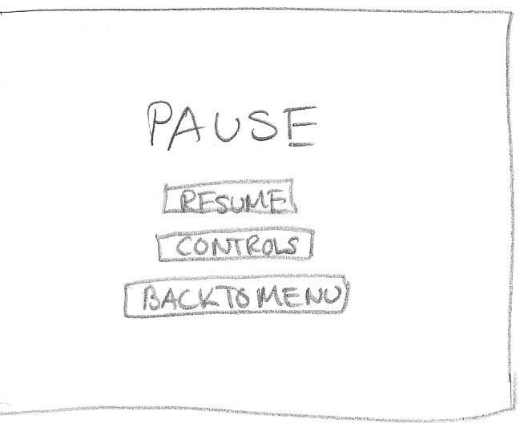

Game Design Document
====================

Objective
--------------------
The objective of the game is to get from one end to 
the other without dying. The player must avoid the
enemies while keeping up with the screen.

Objects
--------------------
My game will include the following "objects":
- Yoshi (playable character) - moves by the player's command

	
- Goomba (enemy) - moves from right to left

	
- Koopa (enemy) - moves from right to left

	
- Bullet Bill (enemy) - moves from right to left or left to right

	
- Kamek (enemy) - appears and shoots magic

	
- Magic (enemy ammo) - moves across

	
- Coin (item) - still object

Score
--------------------
The scoring is as follows:

- 100 points for every second that passes
	
	
- 50 points for every coin collected
	
- 100 points for every killed enemy
	
Life
--------------------
The player starts with three lives. He or she 
can obtain more lives by collecting five coins.
If the player touches an enemy or magic, he or she
loses a life. When a player loses all of his or her
lives, its game over.

Layout
--------------------

On the game screen, the lives, coins, and score will be
displayed on top. The game will be displayed underneath.
During the game, the player can press 'p' to pause.

On the pause menu, the screen will show buttons to 
go back to the start menu, unpause, or show the
controls of the game. On the start menu, the screen
will show buttons to start, show the instructions, 
show the controls, and quit the window.
